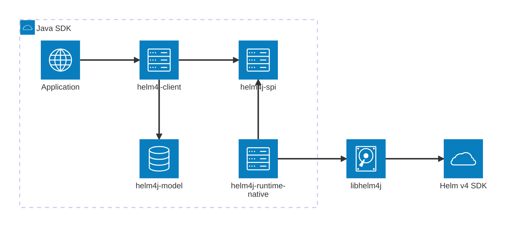

# Architecture

Helm4j separates its public Java API from runtime implementations. Applications depend on the client; the client discovers an engine through `ServiceLoader`; the bundled engine crosses the FFM boundary into Helm's Go SDK.

## Modules

| Project                 | JPMS module                      | Responsibility                                                               |
| ----------------------- | -------------------------------- | ---------------------------------------------------------------------------- |
| `helm4j-model`          | `dev.nthings.helm4j.model`       | Requests, results, value types, enums, and exceptions                        |
| `helm4j-spi`            | `dev.nthings.helm4j.spi`         | `HelmEngine`, provider discovery contract, and five domain gateways          |
| `helm4j-client`         | `dev.nthings.helm4j`             | `HelmClient`, options, result capture, and namespace clients                 |
| `helm4j-runtime-native` | `dev.nthings.helm4j.runtime.ffm` | FFM bindings, JSON mapping, native library lookup, and the `native` provider |
| `helm4j-samples`        | `dev.nthings.helm4j.samples`     | Runnable offline, network, and cluster examples                              |
| `libhelm4j`             | Native shared library            | cgo exports and operation packages built against Helm v4                     |

The model has no client, native, or JSON dependency. Both the client and runtime depend on the SPI, so another engine can replace the native provider without changing application code.

## Provider lifecycle

`HelmClient.create()` selects the first discovered `HelmEngineProvider`. `HelmClientOptions.runtime(id)` selects a provider by ID; the bundled provider ID is `native`. `HelmClient.using(engine)` bypasses discovery for tests or custom runtimes.

The client owns its engine and is `AutoCloseable`. Namespace clients are created once and delegate to the engine's release, chart, repository, registry, and system gateways.

## Native call path

For each operation, the native runtime:

1. maps a model request to a JSON option object;
2. calls a generated jextract binding with UTF-8 data;
3. lets `libhelm4j` execute the matching Helm SDK action;
4. decodes the JSON envelope into public model records.

Go errors and recovered panics return structured error envelopes. Java maps command failures to `HelmCommandException` and bridge failures to `HelmRuntimeException`.

The model module is not opened to Jackson. Only runtime-private payload records are reflectively deserialized.

## Native library lookup

The FFM runtime searches for `libhelm4j.so` in this order:

1. `-Dhelm4j.library.path=<file-or-directory>`;
2. `libhelm4j/libhelm4j.so` under the working directory;
3. each `java.library.path` entry;
4. the platform loader path, such as `LD_LIBRARY_PATH`.

The current build and smoke test target Linux. The repository does not yet package native libraries into published artifacts.

## Current configuration boundary

`HelmClientOptions` separates provider selection from engine configuration. `runtime("native")` works today because the client consumes it during discovery. The native provider currently ignores `kubeContext` and custom properties; Helm therefore uses its normal environment and active context. This is an implementation gap, not a supported configuration path.
