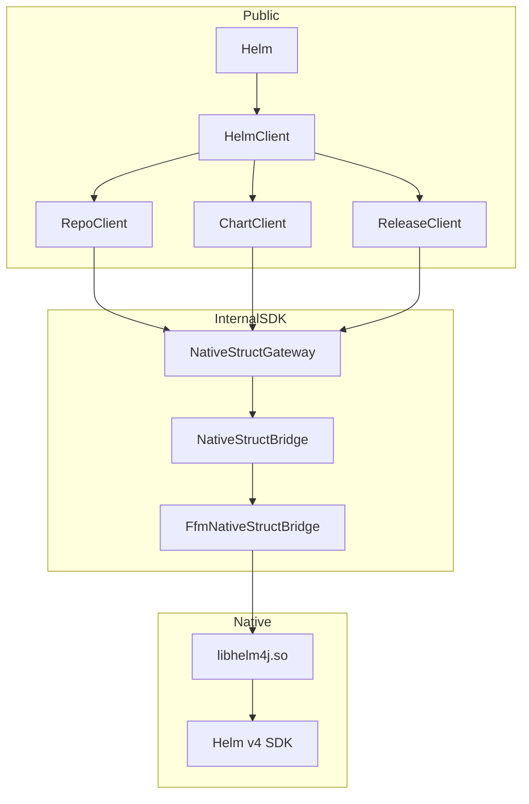

# Helm4j Specification (Standard SDK)

## 1. Overview

Helm4j is a Java-first SDK for Helm v4.

Design goals:

- Idiomatic Java API (`Helm.client()` + namespace clients)
- Immutable request/result carriers (records)
- Sealed domain outcomes for operation state
- JSON-native bridge over JDK 25 FFM
- Clear separation between public API and native transport internals

## 2. Public API

### 2.1 Entry Point

```java
public final class Helm {
  public static HelmClient client();
  public static HelmClient client(Consumer<HelmClient.Builder> spec);
}

public final class HelmClient implements AutoCloseable {
  public RepoClient repo();
  public ChartClient chart();
  public ReleaseClient release();
}
```

### 2.2 Namespace Clients

- `RepoClient`
  - `RepoAddResult add(String name, String url)`
  - `RepoAddResult add(Consumer<RepoAddRequest.Builder> spec)`
  - `RepoAddResult add(RepoAddRequest request)`
  - `RepoUpdateResult update()`
  - `RepoUpdateResult update(Consumer<RepoUpdateRequest.Builder> spec)`
  - `RepoUpdateResult update(RepoUpdateRequest request)`
  - `RepoListResult list()`
  - `RepoRemoveResult remove(String... names)`
  - `RepoRemoveResult remove(Consumer<RepoRemoveRequest.Builder> spec)`
  - `RepoRemoveResult remove(RepoRemoveRequest request)`
- `ChartClient`
  - `RepoSearchResult searchRepo(String keyword)`
  - `RepoSearchResult searchRepo(String keyword, Consumer<RepoSearchRequest.Builder> spec)`
  - `RepoSearchResult searchRepo(RepoSearchRequest request)`
  - `HubSearchResult searchHub(String keyword)`
  - `HubSearchResult searchHub(String keyword, Consumer<HubSearchRequest.Builder> spec)`
  - `HubSearchResult searchHub(HubSearchRequest request)`
  - `ShowChartResult chart(ChartRef chartReference)`
  - `ShowChartResult chart(ChartRef chartReference, Consumer<ShowRequest.Builder> spec)`
  - `ShowChartResult chart(ChartRef chartReference, ShowRequest request)`
  - `ShowValuesResult values(ChartRef chartReference)`
  - `ShowValuesResult values(ChartRef chartReference, Consumer<ShowRequest.Builder> spec)`
  - `ShowValuesResult values(ChartRef chartReference, ShowRequest request)`
  - `ShowReadmeResult readme(ChartRef chartReference)`
  - `ShowReadmeResult readme(ChartRef chartReference, Consumer<ShowRequest.Builder> spec)`
  - `ShowReadmeResult readme(ChartRef chartReference, ShowRequest request)`
  - `ShowCrdsResult crds(ChartRef chartReference)`
  - `ShowCrdsResult crds(ChartRef chartReference, Consumer<ShowRequest.Builder> spec)`
  - `ShowCrdsResult crds(ChartRef chartReference, ShowRequest request)`
  - `ShowAllResult all(ChartRef chartReference)`
  - `ShowAllResult all(ChartRef chartReference, Consumer<ShowRequest.Builder> spec)`
  - `ShowAllResult all(ChartRef chartReference, ShowRequest request)`
- `ReleaseClient`
  - `InstallResult install(Consumer<InstallRequest.Builder> spec)`
  - `InstallResult install(InstallRequest request)`

### 2.3 Model Strategy

- Request/response carriers are records
- Install and repo add return sealed domain outcomes:
  - `InstallResult = InstallSuccess | InstallPending | InstallFailure`
  - `RepoAddResult = RepoAddSuccess | RepoAddFailure`
- Typed chart references via sealed `ChartRef`:
  - `RepoChartRef`
  - `OciChartRef`
  - `LocalChartRef`

## 3. Internal Architecture



## 4. Native C Bridge

The Java SDK invokes JSON-native operations exported by `libhelm4j`:

- `HelmRepo(char* mode, char* optionsJson) -> char*`
- `HelmSearch(char* mode, char* optionsJson) -> char*`
- `HelmShow(char* mode, char* chartRef, char* optionsJson) -> char*`
- `HelmInstall(char* releaseName, char* chartRef, char* optionsJson) -> char*`

Each response is a UTF-8 JSON string released with:

- `FreeString(char* value)`

## 5. Data Marshalling

`NativeStructGateway` maps Java request records to JSON option payloads and
maps JSON responses back to typed Java results using Jackson.

Principles:

- Public API remains transport-agnostic
- FFM bridge allocates operation-scoped C strings (`Arena.ofConfined()`)
- Explicit native response free calls through `FreeString`
- Error payloads (`error`, `stage`, `operation`) are mapped consistently to
  `HelmException` or domain failures (`RepoAddFailure`, `InstallFailure`)

## 6. Error and Outcome Model

- Transport/runtime/contract issues throw `dev.nthings.helm4j.errors.HelmException`
- Domain operation outcomes are typed sealed results:
  - install pending/failed/success
  - repo add success/failure

This keeps user code ergonomic while preserving strict transport diagnostics.

## 7. JDK and Runtime Requirements

- JDK 25
- Native access enabled (`--enable-native-access=ALL-UNNAMED` in tests/build)
- Go 1.26 for `libhelm4j` builds

## 8. Current Scope

Implemented in this standard SDK iteration:

- Repo add/update/list/remove
- Search repo/hub
- Show chart/values/readme/crds/all
- Release install

Remaining Helm actions (upgrade/rollback/uninstall/status/history/get/template/lint)
are intentionally out of scope and will be added on the same gateway
architecture.
