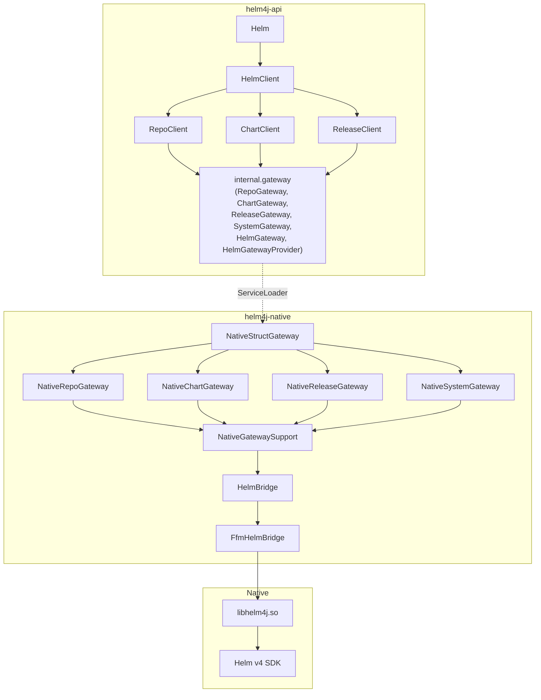

# Helm4j Specification (Standard SDK)

## 1. Overview

Helm4j is a Java-first SDK for Helm v4.

Design goals:

- Idiomatic Java API (`Helm.client()` + namespace clients)
- Immutable request/result carriers (records)
- Sealed domain outcomes for operation state
- JSON-native bridge over JDK 25 FFM
- Clear separation between public API and native transport internals

## 2. Public API

### 2.1 Entry Point

```java
public final class Helm {
  public static HelmClient client();
  public static HelmClient client(Consumer<HelmClient.Builder> spec);
  public static InstallBuilder install(ChartRef chart);
  public static UpgradeBuilder upgrade(ChartRef chart);
  public static VersionInfo version();
}

public final class HelmClient implements AutoCloseable {
  public RepoClient repo();
  public ChartClient chart();
  public ReleaseClient release();
  public VersionInfo version();
}
```

### 2.2 Namespace Clients

- `RepoClient`
  - `RepoAddResult add(Consumer<RepoAddRequest.Builder> spec)`
  - `RepoAddResult add(RepoAddRequest request)`
  - `RepoUpdateResult update()`
  - `RepoUpdateResult update(Consumer<RepoUpdateRequest.Builder> spec)`
  - `RepoUpdateResult update(RepoUpdateRequest request)`
  - `RepoListResult list()`
  - `RepoRemoveResult remove(Consumer<RepoRemoveRequest.Builder> spec)`
  - `RepoRemoveResult remove(RepoRemoveRequest request)`
  - `RegistryResult registryLogin(Consumer<RegistryLoginRequest.Builder> spec)`
  - `RegistryResult registryLogin(RegistryLoginRequest request)`
  - `RegistryResult registryLogout(Consumer<RegistryLogoutRequest.Builder> spec)`
  - `RegistryResult registryLogout(RegistryLogoutRequest request)`
- `ChartClient`
  - `RepoSearchResult searchRepo(Consumer<RepoSearchRequest.Builder> spec)`
  - `RepoSearchResult searchRepo(RepoSearchRequest request)`
  - `HubSearchResult searchHub(Consumer<HubSearchRequest.Builder> spec)`
  - `HubSearchResult searchHub(HubSearchRequest request)`
  - `ShowResult show(ShowMode mode, ChartRef chartReference, Consumer<ShowRequest.Builder> spec)`
  - `ShowResult show(ShowMode mode, ChartRef chartReference, ShowRequest request)`
  - `TemplateResult template(Consumer<TemplateRequest.Builder> spec)`
  - `TemplateResult template(TemplateRequest request)`
  - `LintResult lint(Consumer<LintRequest.Builder> spec)`
  - `LintResult lint(LintRequest request)`
  - `PullResult pull(Consumer<PullRequest.Builder> spec)`
  - `PullResult pull(PullRequest request)`
  - `PushResult push(Consumer<PushRequest.Builder> spec)`
  - `PushResult push(PushRequest request)`
  - `PackageChartResult packageChart(Consumer<PackageChartRequest.Builder> spec)`
  - `PackageChartResult packageChart(PackageChartRequest request)`
  - `DependencyResult dependency(Consumer<DependencyRequest.Builder> spec)`
  - `DependencyResult dependency(DependencyRequest request)`
- `ReleaseClient`
  - `InstallResult install(Consumer<InstallRequest.Builder> spec)`
  - `InstallResult install(InstallRequest request)`
  - `UpgradeResult upgrade(Consumer<UpgradeRequest.Builder> spec)`
  - `UpgradeResult upgrade(UpgradeRequest request)`
  - `UninstallResult uninstall(Consumer<UninstallRequest.Builder> spec)`
  - `UninstallResult uninstall(UninstallRequest request)`
  - `StatusResult status(Consumer<StatusRequest.Builder> spec)`
  - `StatusResult status(StatusRequest request)`
  - `RollbackResult rollback(Consumer<RollbackRequest.Builder> spec)`
  - `RollbackResult rollback(RollbackRequest request)`
  - `HistoryResult history(Consumer<HistoryRequest.Builder> spec)`
  - `HistoryResult history(HistoryRequest request)`
  - `ReleaseListResult list()`
  - `ReleaseListResult list(Consumer<ReleaseListRequest.Builder> spec)`
  - `ReleaseListResult list(ReleaseListRequest request)`
  - `TestResult test(Consumer<TestRequest.Builder> spec)`
  - `TestResult test(TestRequest request)`
  - `GetAllResult getAll(Consumer<GetRequest.Builder> spec)`
  - `GetAllResult getAll(GetRequest request)`
  - `GetValuesResult getValues(Consumer<GetRequest.Builder> spec)`
  - `GetValuesResult getValues(GetRequest request)`
  - `GetManifestResult getManifest(Consumer<GetRequest.Builder> spec)`
  - `GetManifestResult getManifest(GetRequest request)`
  - `GetHooksResult getHooks(Consumer<GetRequest.Builder> spec)`
  - `GetHooksResult getHooks(GetRequest request)`
  - `GetNotesResult getNotes(Consumer<GetRequest.Builder> spec)`
  - `GetNotesResult getNotes(GetRequest request)`
  - `GetMetadataResult getMetadata(Consumer<GetRequest.Builder> spec)`
  - `GetMetadataResult getMetadata(GetRequest request)`

Normalization rule:
- Operations use a consistent pair of overloads:
  - `operation(Request request)`
  - `operation(Consumer<Request.Builder> spec)`
- No scalar convenience overloads are part of the public API contract.

### 2.3 Model Strategy

- Request/response carriers are records
- Install and repo add return sealed domain outcomes:
  - `InstallResult = ReleaseSuccess | ReleasePending | ReleaseFailure`
  - `UpgradeResult = ReleaseSuccess | ReleasePending | ReleaseFailure`
  - `UninstallResult = UninstallSuccess | ReleaseFailure`
  - `RollbackResult = RollbackSuccess | ReleaseFailure`
  - `RepoAddResult = RepoAddSuccess | RepoAddFailure`
- Typed chart references via sealed `ChartRef`:
  - `RepoChartRef`
  - `OciChartRef`
  - `LocalChartRef`

## 3. Internal Architecture



### 3.1 Module Boundaries

The project is split into two published modules plus `buildSrc`:

- **`helm4j-api`** — the public SDK and the entire domain model (records, sealed
  outcomes). It owns the gateway SPI in `internal.gateway`, qualified-exported
  *only* to `helm4j-native`.
- **`helm4j-native`** — the FFM runtime: the `HelmBridge` transport contract, its
  `FfmHelmBridge` implementation, the per-domain gateways, and the
  `HelmGatewayProvider` service.

`helm4j-native` depends on `helm4j-api` at compile time; `helm4j-api` has **no**
compile-time reference to the native module. The dependency cycle that would
otherwise exist (the API needs a gateway, the gateway needs the API's model) is
broken at runtime with `ServiceLoader<HelmGatewayProvider>` — hence the
`@SuppressWarnings("module")` on the qualified export, which names a module
`javac` cannot see at compile time.

A third `helm4j-spi` module is **deliberately not** introduced: the gateway
interfaces traffic in the full domain model, so extracting them would duplicate
nearly all of `helm4j-api`. The two-module shape is the clean cut.

## 4. Native C Bridge

The Java SDK invokes JSON-native operations exported by `libhelm4j`:

- `HelmRepo(char* mode, char* optionsJson) -> char*`
- `HelmSearch(char* mode, char* optionsJson) -> char*`
- `HelmShow(char* mode, char* chartRef, char* optionsJson) -> char*`
- `HelmInstall(char* releaseName, char* chartRef, char* optionsJson) -> char*`
- `HelmUpgrade(char* releaseName, char* chartRef, char* optionsJson) -> char*`
- `HelmUninstall(char* releaseName, char* optionsJson) -> char*`
- `HelmStatus(char* releaseName, char* optionsJson) -> char*`
- `HelmRollback(char* releaseName, char* optionsJson) -> char*`
- `HelmHistory(char* releaseName, char* optionsJson) -> char*`
- `HelmGet(char* mode, char* releaseName, char* optionsJson) -> char*`
- `HelmTemplate(char* releaseName, char* chartRef, char* optionsJson) -> char*`
- `HelmLint(char* chartPath, char* optionsJson) -> char*`
- `HelmList(char* optionsJson) -> char*`
- `HelmPull(char* chartRef, char* optionsJson) -> char*`
- `HelmPush(char* chartRef, char* remote, char* optionsJson) -> char*`
- `HelmPackage(char* chartPath, char* optionsJson) -> char*`
- `HelmDependency(char* chartPath, char* optionsJson) -> char*`
- `HelmRegistry(char* mode, char* hostname, char* optionsJson) -> char*`
- `HelmTest(char* releaseName, char* optionsJson) -> char*`
- `HelmVersion() -> char*`

Each response is a UTF-8 JSON string released with:

- `FreeString(char* value)`

## 5. Data Marshalling

The per-domain native gateways (`NativeRepoGateway`, `NativeChartGateway`,
`NativeReleaseGateway`, `NativeSystemGateway`) map Java request records to JSON
option payloads and map JSON responses back to typed Java results using Jackson,
sharing the encode/decode plumbing in `NativeGatewaySupport`.

Principles:

- Public API remains transport-agnostic
- FFM bridge allocates operation-scoped C strings (`Arena.ofConfined()`)
- Explicit native response free calls through `FreeString`
- Error payloads (`error`, `stage`, `operation`) are mapped consistently to
  `HelmException` or domain failures (`RepoAddFailure`, `ReleaseFailure`)

## 6. Error and Outcome Model

- Transport/runtime/contract issues throw `dev.nthings.helm4j.errors.HelmException`
- Domain operation outcomes are typed sealed results:
  - install pending/failed/success
  - upgrade pending/failed/success
  - uninstall success/failure
  - rollback success/failure
  - repo add success/failure

This keeps user code ergonomic while preserving strict transport diagnostics.

## 7. JDK and Runtime Requirements

- JDK 25
- Native access enabled (`--enable-native-access=ALL-UNNAMED` in tests/build)
- Go 1.26 for `libhelm4j` builds
